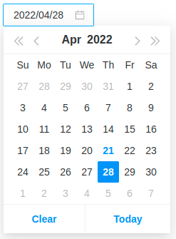

# mor-react-datepicker

`mor-react-datepicker` is a datepicker ReactJS component.

# Demo
<https://demo-mor-react-datepicker.vercel.app/>



# Getting started

## Install

```sh
$ npm install mor-react-datepicker
```

Alternatively, you may use the provided UMD builds directly in the `<script>` tag of an HTML page. See [this section](#using-umd-build-in-the-browser).

## Usage Example

```javascript
import Datepicker from 'mor-react-datepicker'

const MyComponent = () => {
  const [value, setValue] = useState('')

  const handleValueChange = (newValue) => {
    setValue(newValue)
  }

  return <Datepicker value={value} onChange={handleValueChange} />
}

export default MyComponent
```

| Prop                | Description                                      | Type                                            | Default        |
| ------------------- | ------------------------------------------------ | ----------------------------------------------- | -------------- |
| value               | default value => '', week value format [yyyy,mm] | `string number array`                           | -------------- |
| onChange            | callback function                                | `func`                                          | -------------- |
| placeholder         | placeholder text                                 | `string`                                        | -------------- |
| picker              | type picker                                      | `string`                                        | 'date'         |
| format              | YYYY/MM/DD or DD/MM/YYYY                         | `string`                                        | 'YYYY/MM/DD'   |
| disabled            | ------------------------------------------------ | `boolean`                                       | false          |
| minDate             | ------------------------------------------------ | `string`                                        | '1900/01/01'   |
| maxDate             | ------------------------------------------------ | `string`                                        | '2100/12/31'   |

## License

Copyright (c) 2022 Khanh Nguyen - MOR Software JSC.

Licensed under The MIT License (MIT).
